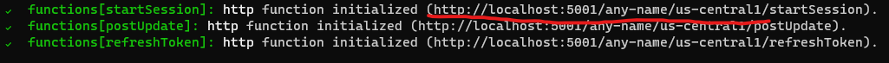

# Contributing

Currently, Pogify is open to contributors but please note that Pogify is stil in its infancy and undergoing rapid development which means we will not be assigning particular tasks to non-maintainers. This also means that we may be liable to reject pull requests that cause **major** conflicts with a mainatiner's local repository. Due to this, please first discuss the change you may wish to make via Github issue or with someone with the Developer role on our [Discord](https://discord.gg/bU6E9Xj) before making a change. With that said, do not be afraid to make a pull request as it will likely be accepted provided you have contacted a maintainer prior to working on it. Pogify is also looking for potential contributors with skills that extend beyond code. If you think you have skills that could be of any benefit to Pogify, please do reach out to us on our [Discord server](https://discord.gg/bU6E9Xj)!

Pogify's contributors are bound to the Contributor Covenant Code of Conduct, found in this repository as "CODE_OF_CONDUCT.md"

If you are looking to help with UI/UX, please note that we do not have a style guide as of yet which means you will have to essentially "wing it" should you wish to contribute.

## Pull Request Guidelines

1. Only pull requests to the development branch will be honored.
2. Explain what you did and how.
3. If its a new feature, explain what it is.
4. Add a screen shot if applicable.
5. As it stands, pull requests that modify core components will not be honored. (unless otherwise discussed with maintainers, as above).

## Set up a local development environment

**Refer to '[Starting up a local development environment](https://github.com/Pogify/pogify/blob/develop/CONTRIBUTING.md#starting-up-a-local-development-environment)' if you have already set up a local development environment**

**If you have difficulty setting up this environment, do _not_ open an issue. Message one of the admins or ask for help on this [Discord server](https://discord.gg/bU6E9Xj).**

### Prerequisites

- Git ([Windows](https://git-scm.com/download/win) | [MacOS](https://git-scm.com/download/mac) | [Linux](https://git-scm.com/download/linux))
- Node.js 10+ & NPM 6+ ([Windows, MacOS, and Linux](https://nodejs.org/en/download))
- Yarn (`npm i -g yarn` or [Yarn's Website](https://classic.yarnpkg.com/en/docs/install/))
- A [Spotify API Client ID](https://developer.spotify.com/dashboard/applications) (In doing so, please ensure you configure the auth redirect correctly. The redirect for the app is `http://localhost:{PORT}/auth` where port is the port of the create-react-app dev server (default: 3000).

### Setting up the backend

1. Clone [Pogify/pogify-functions](https://github.com/Pogify/pogify-functions). (`git clone https://github.com/Pogify/pogify-functions.git`)
2. Change directory `cd` into the newly created `pogify-functions` repo
3. Install the standalone Firebase CLI from [their website](https://firebase.google.com/docs/cli) or, install the firebase command globally with `npm i -g firebase-tools`
4. Run `firebase init` in the `pogify-functions` repo and follow the instructions.
   - When prompted to select particular Firebase CLI features, only select `Database`, `Functions` and `Emulators`.
   - Select `Don't set up a default project` when prompted with project setup options.
   - Accept `database.rules.json` as the Firebase Realtime Database Rules file.
   - Designate `TypeScript` as the language for Cloud Functions.
   - Answer yes if asked to use `TSLint`.
   - DO **NOT** overwrite any existing files when prompted.
   - Answer yes when asked to install dependencies with NPM.
   - Select **both** `Functions` and `Database` at the Emulators Setup prompt.
   - We recommend using the default ports for both the functions and database emulator, however, any should work granted there are no conflicts.
   - The emulator UI is not necessary, however, it should cause no conflicts if you proceed to use it.
   - Answer yes when asked if you would like to download the emulators now.
5. Create a file called `.runtimeconfig.json` in the `functions` folder within the repo with the following text:
   ```json
   {
     "jwt": {
       "secret": "anysecretyoudlike"
     }
   }
   ```
6. Change directory `cd` into the `functions` folder within the repo and run `npm run build`.
7. Run `firebase --project=any-name emulators:start` and note the URL of the emulated functions. (e.g. "localhost:5001/any-name/us-central1")
   
   - Note: Keep the window open while you are working on the project!

Congratulations, you should now be running a local environment for the backend of Pogify!

### Setting up the frontend

1. Clone this repo (`git clone https://github.com/Pogify/pogify.git`)
2. Switch to the `develop` branch (`git checkout develop`)
3. Change directory `cd` to the newly created `pogify` repo and install dependencies with `yarn install`.
4. Create a file in the directory named `.env` or `.env.development.local`, replace {URL} with the URL of your emulated functions (from your Firebase CLI window) and {CLIENT_ID} with your Spotify API Client ID from the prerequisites.
   ```
     REACT_APP_SUB=https://messages.pogify.net
     REACT_APP_CLOUD_FUNCTION_EMULATOR_BASE_URL={URL}
     REACT_APP_SPOTIFY_CLIENT_ID={CLIENT_ID}
   ```

- Note: mesages.pogify.net is the current production endpoint for subscribing to events. It's ok to use this endpoint in a local development environment.

4. Make sure `pogify-functions` firebase emulators are running (If not, follow the above backend setup!)
5. Run `yarn start`.
   Congratulations, you should now be running a local environment for the frontend of Pogify!

###### A couple notes:

- Sessions hosted from local environments cannot be joined from the pogify.net production deployment.
- Sessions hosted on a pogify.net production deployment can be joined from a local environment.
- Missing any one step wil throw an error. Be sure to read each and every single instruction carefully.
- If you click `join a session`, you will be stuck on the 'waiting for host' modal unless there is an active sesion w/ a host. (We are working on something so people can develop the listener player with 2 accounts.)

## Starting up a local development environment

**Refer to '[Set up a local development environment](https://github.com/Pogify/pogify/blob/develop/CONTRIBUTING.md#set-up-a-local-development-environment)' if you have not yet set up a local development environment with the instructions provided above.**
**If you have difficulty starting up your environments, do _not_ open an issue. Message one of the admins or ask for help on the [discord server](https://discord.gg/bU6E9Xj).**

1. Change directory `cd` into the `pogify-functions` repo.
2. Run `firebase --project=any-name emulators:start` and note the URL of the emulated functions (e.g. "localhost:5001/any-name/us-central1") and leave the window running.
3. If the URL of the emulated functions does not match the one in your `.env` or `.env.development.local` file, change the file.
4. Change directory `cd` into the `pogify` repo.
5. Run `yarn start`.

## Naming Scheme Conventions

- React components are PascalCased
- non React js files are camelCased
- folders are hyphen-cased
- test files are cased according to the file that the test runs
- CSS files are PascalCased
  - Note: we are transitioning away from separate CSS files as well as inline styles for styled components. Please refrain from using either separate CSS files or inline

## Directory structure

- `/src` all source files
  - `/src/routes` components that react-router
  - `/src/components` other components
  - `/src/layouts` layout related HOCs
  - `/src/modals` modal components
  - `/src/stores` mobx stores
  - `/src/context` contexts
  - `/src/hooks` react hooks
  - `/src/styles` CSS files for component styling
    - Note: avoid writing CSS files and use styled-components instead
  - `/src/utils` utility functions
- `src/__tests__` all tests
  - `src/__tests__/unit` unit tests
    - follows structure of src files
  - `src/__tests__/integration` integration tests
- `src/__mocks__` test mocks
- `src/__utils__` test utils

## **Thanks for contributing to Pogify! We can't wait to see what you do with it!**
