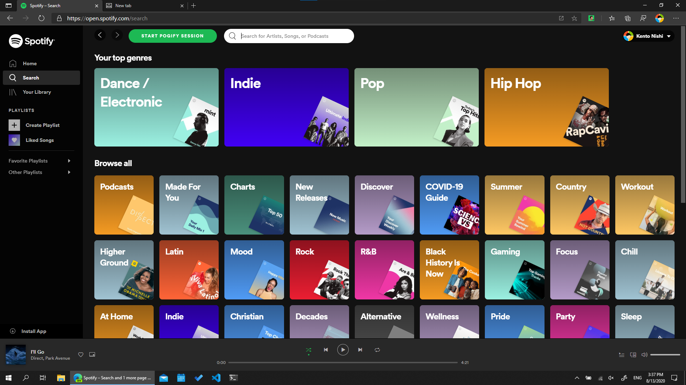
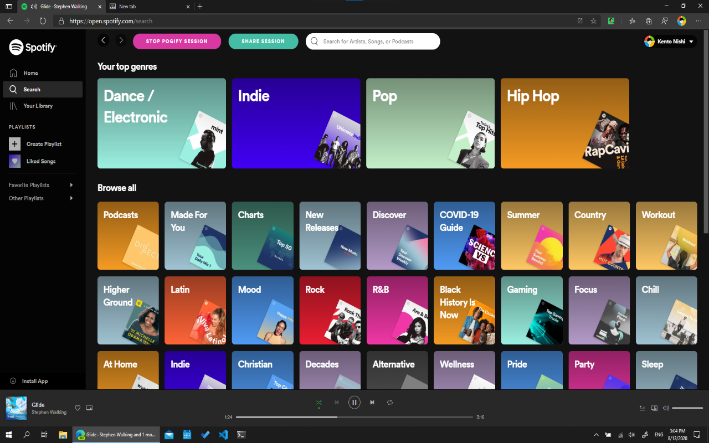
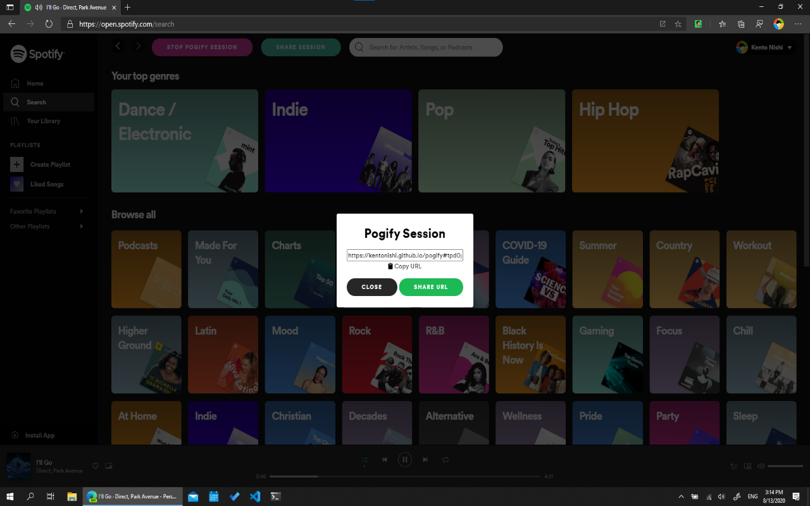
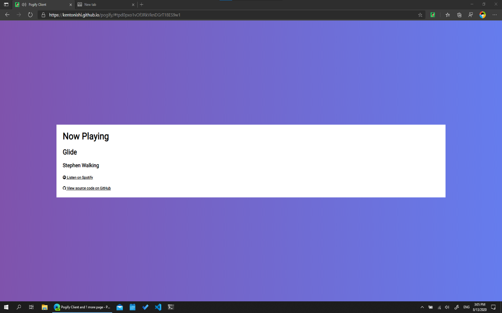

# Pogify

Listen to music with your stream chat without getting DMCA-striked.

> I just want like my songs to play on your computer when I uh, when I play them on my computer.
>
> -- <cite>Michael Reeves</cite>

## Status

This project relies upon a realtime database from [Firebase](https://firebase.google.com/) which in its free tier will only allow for 100 simultaneous connections and therefore only 99 viewers. To allow for more users, the developers will be looking into either engineering an alternative to Firebase's realtime database or crowdfunding for a Firebase paid plan.

## How It Works

1. A [mutation observer](https://developer.mozilla.org/en-US/docs/Web/API/MutationObserver) is launched on the streamer's spotify website.

2. The observer updates the Firebase Realtime Database when the streamer's song or timestamp within the song changes.

3. The client adjusts its hidden youtube video based upon the changes in the realtime database.

## Usage

### Streamer

1. Install the extension.

2. Open up your spotify playlist.

3. Click ``start pogify`` button at the top and log in with google.

4. Click ``share session`` button at the top and copy the link.

5. Distribute the link among viewers.

### Chat

Open the link your streamer sent you

## Credits

* [Kento Nishi](https://github.com/kentonishi) - extension and client frontend, database
* [Ronak Badhe](https://github.com/r2dev2bb8) - spotify observer, database
