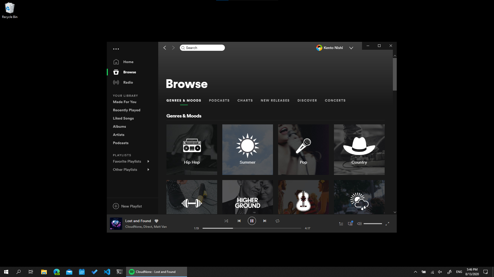
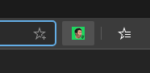
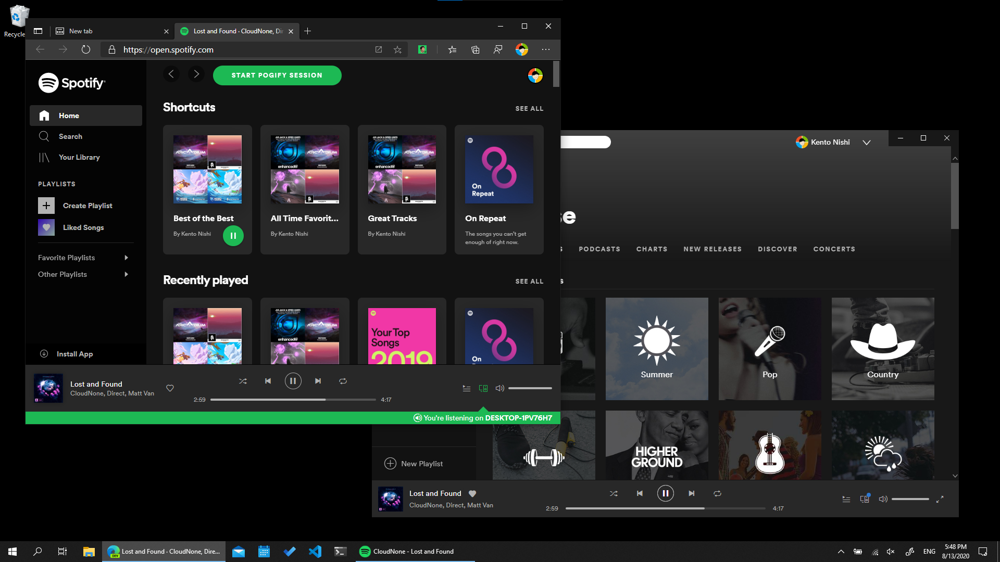
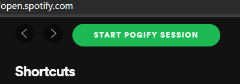
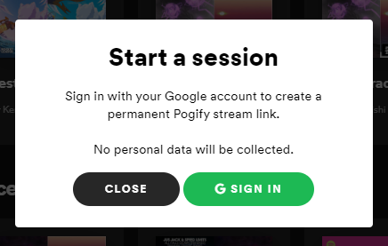
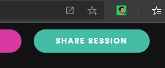
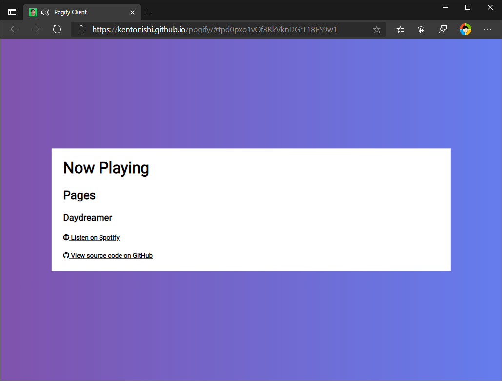

# Pogify Client & Chrome Extension

Listen to music with your stream chat without getting DMCA-striked.

> I just want like my songs to play on your computer when I uh, when I play them on my computer.
>
> -- <cite>Michael Reeves</cite>

## What is Pogify?

Pogify is a service that enables streamers to listen to music together with their viewers. The streamer can start a session using the Pogify Chrome extension, and chat can listen along with a stream link.

## Usage

### Streamer

1. Install the Chrome extension availabe [on the Chrome Web Store]().

1. Open Spotify Desktop and begin playing music as you normally do.

    

1. Click on the Pogify icon at the top right of your Chrome window.

    

    Clicking the button will open Spotify web (https://open.spotify.com).

    
    
1. Click on the `Start Pogify Session` button to start a new session.

    

    You will be asked to sign in with your Google account to create a permanent stream link. No personal data will be collected.

    

1. After signing in, share your Pogify session using the `Share Session` button.

    

    Copy the link and share it with the chat.

    

1. You are good to go! **Make sure you leave the Spotify web tab open in the background**. You can continue to use Spotify Desktop for your own listening.

### Chat

Open the link your streamer shared with you.

You are good to go! **Make sure to keep the tab open in the background while you watch the stream.** You can now watch the streamer on a different tab while streaming their music.

## Status

This project relies upon a realtime database from [Firebase](https://firebase.google.com/) which in its free tier will only allow for 100 simultaneous connections and therefore only 99 viewers. To allow for more users, the developers will be looking into either engineering an alternative to Firebase's realtime database or crowdfunding for a Firebase paid plan.

## How It Works

1. A [mutation observer](https://developer.mozilla.org/en-US/docs/Web/API/MutationObserver) is launched on the streamer's spotify website.

2. The observer updates the Firebase Realtime Database when the streamer's song or timestamp within the song changes.

3. The client adjusts its hidden youtube video based upon the changes in the realtime database.

## Credits

* [Kento Nishi](https://github.com/kentonishi) - extension and client frontend, database
* [Ronak Badhe](https://github.com/r2dev2bb8) - spotify observer, database
